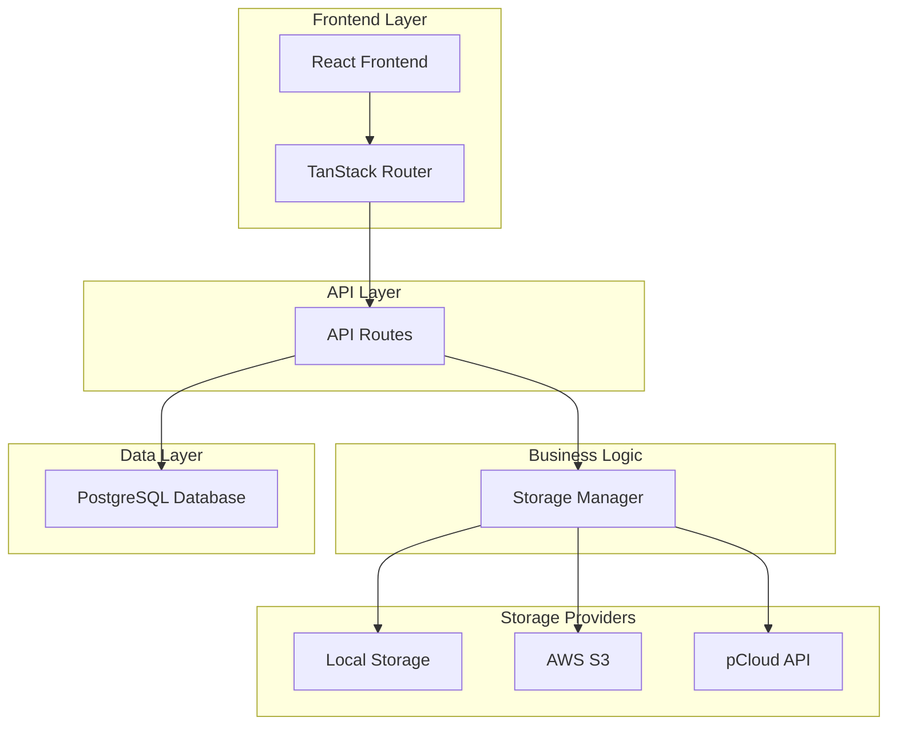
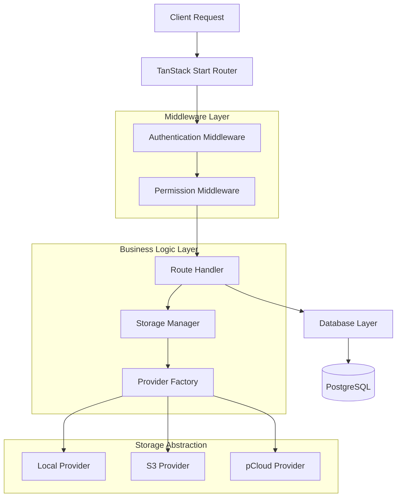
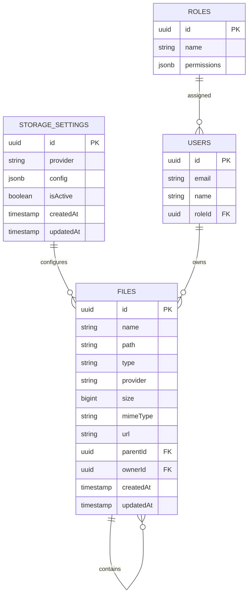

## 1. Architecture Design



## 2. Technology Description
- Frontend: React@19 + TanStack Start + TanStack Query + TanStack Form + valibot + tailwindcss
- Backend: TanStack Start Server Routes + drizzle-orm
- Database: PostgreSQL
- Storage: AWS SDK v3, pCloud SDK, Node.js fs module
- Authentication: Better-auth integration

## 3. Route Definitions
| Route | Purpose |
|-------|---------|
| /dashboard/file-manager | Main file manager interface with folder tree and file explorer |
| /dashboard/admin/storage-settings | Admin configuration for storage providers |
| /api/files | CRUD operations for files and folders |
| /api/storage-settings | Storage provider configuration management |
| /api/files/upload | File upload endpoint with multi-provider support |
| /api/files/download/:id | Secure file download with signed URLs |

## 4. API Definitions

### 4.1 Core API

**File Management**
```
GET /api/files
```
Request:
| Param Name | Param Type | isRequired | Description |
|------------|------------|------------|-------------|
| path | string | false | Folder path to list files |
| page | number | false | Pagination page number |
| limit | number | false | Items per page |
| type | string | false | Filter by 'file' or 'folder' |

Response:
| Param Name | Param Type | Description |
|------------|------------|-------------|
| files | FileItem[] | Array of files and folders |
| totalCount | number | Total number of items |
| hasMore | boolean | Whether more pages exist |

```
POST /api/files/upload
```
Request:
| Param Name | Param Type | isRequired | Description |
|------------|------------|------------|-------------|
| files | File[] | true | Files to upload |
| path | string | false | Target folder path |

Response:
| Param Name | Param Type | Description |
|------------|------------|-------------|
| uploadedFiles | FileItem[] | Successfully uploaded files |
| errors | UploadError[] | Upload errors if any |

**Storage Settings**
```
GET /api/storage-settings
```
Response:
| Param Name | Param Type | Description |
|------------|------------|-------------|
| provider | string | Current storage provider |
| config | StorageConfig | Provider-specific configuration |

```
PUT /api/storage-settings
```
Request:
| Param Name | Param Type | isRequired | Description |
|------------|------------|------------|-------------|
| provider | string | true | Storage provider type |
| config | StorageConfig | true | Provider configuration |

## 5. Server Architecture Diagram



## 6. Data Model

### 6.1 Data Model Definition



### 6.2 Data Definition Language

**Storage Settings Table**
```sql
CREATE TABLE storage_settings (
    id UUID PRIMARY KEY DEFAULT gen_random_uuid(),
    provider VARCHAR(20) NOT NULL CHECK (provider IN ('local', 's3', 'pcloud')),
    config JSONB NOT NULL DEFAULT '{}',
    is_active BOOLEAN DEFAULT true,
    created_at TIMESTAMP WITH TIME ZONE DEFAULT NOW(),
    updated_at TIMESTAMP WITH TIME ZONE DEFAULT NOW()
);

-- Ensure only one active storage provider
CREATE UNIQUE INDEX idx_storage_settings_active ON storage_settings(is_active) WHERE is_active = true;
```

**Files Table**
```sql
CREATE TABLE files (
    id UUID PRIMARY KEY DEFAULT gen_random_uuid(),
    name VARCHAR(255) NOT NULL,
    path TEXT NOT NULL DEFAULT '/',
    type VARCHAR(10) NOT NULL CHECK (type IN ('file', 'folder')),
    provider VARCHAR(20) NOT NULL,
    size BIGINT DEFAULT 0,
    mime_type VARCHAR(100),
    url TEXT,
    parent_id UUID REFERENCES files(id) ON DELETE CASCADE,
    owner_id UUID REFERENCES users(id) ON DELETE SET NULL,
    created_at TIMESTAMP WITH TIME ZONE DEFAULT NOW(),
    updated_at TIMESTAMP WITH TIME ZONE DEFAULT NOW()
);

-- Indexes for performance
CREATE INDEX idx_files_path ON files(path);
CREATE INDEX idx_files_parent_id ON files(parent_id);
CREATE INDEX idx_files_owner_id ON files(owner_id);
CREATE INDEX idx_files_type ON files(type);
CREATE UNIQUE INDEX idx_files_path_name ON files(path, name) WHERE parent_id IS NULL;

-- Permissions for Supabase
GRANT SELECT ON storage_settings TO anon;
GRANT ALL PRIVILEGES ON storage_settings TO authenticated;
GRANT SELECT ON files TO anon;
GRANT ALL PRIVILEGES ON files TO authenticated;
```

**File Permissions Table**
```sql
CREATE TABLE file_permissions (
    id UUID PRIMARY KEY DEFAULT gen_random_uuid(),
    file_id UUID REFERENCES files(id) ON DELETE CASCADE,
    role_id UUID REFERENCES roles(id) ON DELETE CASCADE,
    can_read BOOLEAN DEFAULT false,
    can_write BOOLEAN DEFAULT false,
    can_delete BOOLEAN DEFAULT false,
    created_at TIMESTAMP WITH TIME ZONE DEFAULT NOW()
);

CREATE UNIQUE INDEX idx_file_permissions_file_role ON file_permissions(file_id, role_id);
GRANT ALL PRIVILEGES ON file_permissions TO authenticated;
```

**Initial Data**
```sql
-- Default storage settings
INSERT INTO storage_settings (provider, config, is_active) VALUES 
('local', '{"basePath": "/uploads", "maxFileSize": 10485760}', true);

-- Root folder
INSERT INTO files (name, path, type, provider) VALUES 
('root', '/', 'folder', 'local');
```