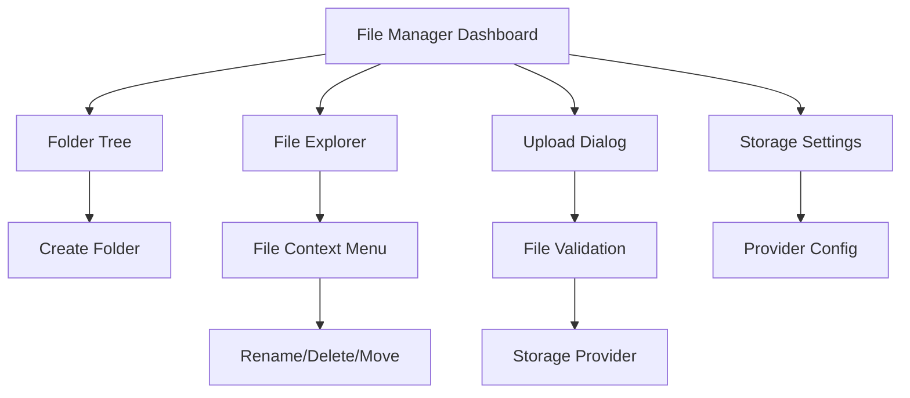

## 1. Product Overview
A comprehensive file management system that supports multiple storage providers (Local, S3, pCloud) with a unified interface for file operations, admin configuration, and role-based permissions.
- Enables seamless file storage and management across different cloud and local storage backends with a single, consistent API and user interface.
- Provides enterprise-grade file management capabilities for web applications requiring scalable, secure, and flexible file storage solutions.

## 2. Core Features

### 2.1 User Roles
| Role | Registration Method | Core Permissions |
|------|---------------------|------------------|
| Admin | System assignment | Full access to storage settings, file management, user permissions |
| Manager | Admin invitation | File upload, delete, rename, move operations |
| User | Standard registration | File view, download, limited upload permissions |
| Guest | Public access | Read-only access to public files |

### 2.2 Feature Module
Our file manager system consists of the following main pages:
1. **File Manager Dashboard**: Main interface with folder tree navigation, file grid/list view, drag-drop uploads.
2. **Storage Settings**: Admin configuration for storage providers (Local, S3, pCloud).
3. **File Operations**: Upload, download, rename, move, delete functionality with context menus.
4. **Permission Management**: Role-based access control for file operations.

### 2.3 Page Details
| Page Name | Module Name | Feature description |
|-----------|-------------|---------------------|
| File Manager Dashboard | Folder Tree Navigation | Display hierarchical folder structure with expand/collapse, real-time updates |
| File Manager Dashboard | File Explorer | Grid and list view toggle, file previews, thumbnails for images, sorting and filtering |
| File Manager Dashboard | Toolbar Actions | Upload files, create new folder, bulk delete, rename, move operations |
| File Manager Dashboard | Context Menu | Right-click actions for individual files/folders (rename, delete, move, properties) |
| File Manager Dashboard | Drag & Drop Interface | Multi-file upload via drag-drop, move files between folders |
| Storage Settings | Provider Configuration | Select storage backend (local/S3/pCloud), configure credentials and settings |
| Storage Settings | Connection Testing | Validate storage provider credentials and connectivity |
| File Operations | Upload Management | Progress tracking, file validation, size limits, mime-type restrictions |
| File Operations | Download Service | Secure file downloads with signed URLs, access logging |
| Permission Management | Role Assignment | Assign file operation permissions based on user roles |
| Permission Management | Access Control | Define read/write/delete permissions per folder or file type |

## 3. Core Process

**Admin Flow:**
1. Admin configures storage provider in Storage Settings
2. Admin sets up folder structure and permissions
3. Admin assigns user roles and file operation permissions
4. Admin monitors file usage and manages storage quotas

**User Flow:**
1. User navigates to File Manager Dashboard
2. User browses folder tree or searches for files
3. User uploads files via drag-drop or upload button
4. User performs file operations (rename, move, delete) based on permissions
5. User downloads files with automatic access logging

## 4. User Interface Design

### 4.1 Design Style
- **Primary Colors:** Blue (#3B82F6) for actions, Gray (#6B7280) for secondary elements
- **Button Style:** Rounded corners (8px), subtle shadows, hover states with color transitions
- **Font:** Inter font family, 14px base size, 16px for headings, 12px for metadata
- **Layout Style:** Split-panel layout with resizable sidebar, card-based file grid, clean list view
- **Icons:** Lucide React icons for consistency, file-type specific icons, folder icons with open/closed states

### 4.2 Page Design Overview
| Page Name | Module Name | UI Elements |
|-----------|-------------|-------------|
| File Manager Dashboard | Folder Tree | Collapsible tree structure, indent lines, folder icons, hover highlights |
| File Manager Dashboard | File Explorer | Grid/list toggle, thumbnail previews, file metadata, selection checkboxes |
| File Manager Dashboard | Toolbar | Icon buttons with tooltips, upload progress bar, breadcrumb navigation |
| Storage Settings | Provider Config | Form fields with validation, connection status indicators, save/test buttons |
| File Operations | Upload Dialog | Drag-drop zone, file list with progress bars, validation messages |
| Permission Management | Role Matrix | Table layout with permission checkboxes, role badges, save confirmation |

### 4.3 Responsiveness
Desktop-first design with mobile-adaptive breakpoints. Touch-optimized interactions for mobile devices including swipe gestures for file operations and responsive grid layouts that stack on smaller screens.