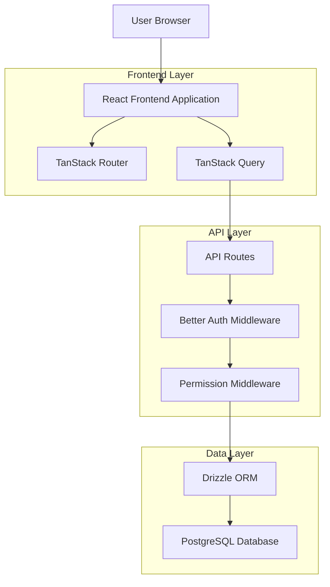
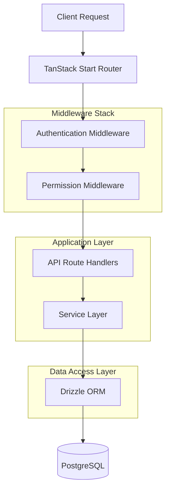
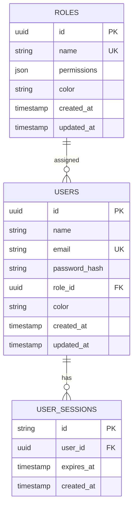

## 1. Architecture design



## 2. Technology Description
- Frontend: React@19 + TanStack Start + TanStack Router + TanStack Query + TanStack Form + valibot + tailwindcss + lucide-react
- Backend: TanStack Start API routes + better-auth + bcrypt
- Database: PostgreSQL + drizzle-orm
- Validation: valibot for form validation and API input validation

## 3. Route definitions
| Route | Purpose |
|-------|---------|
| /auth/login | User authentication page |
| /auth/register | User registration page |
| /dashboard/admin | Admin dashboard with user and role management |
| /dashboard/admin/users | User CRUD interface |
| /dashboard/admin/roles | Role CRUD interface |
| /dashboard/user | User dashboard with permitted sections |
| /profile | User profile management |

## 4. API definitions

### 4.1 Core API

**User Management APIs**
```
GET /api/users
```
Request:
| Param Name | Param Type | isRequired | Description |
|------------|------------|------------|--------------|
| page | number | false | Page number for pagination |
| limit | number | false | Items per page |
| search | string | false | Search term for name/email |
| roleId | string | false | Filter by role ID |

Response:
| Param Name | Param Type | Description |
|------------|------------|-------------|
| users | User[] | Array of user objects |
| total | number | Total count of users |
| page | number | Current page number |

```
POST /api/users
```
Request:
| Param Name | Param Type | isRequired | Description |
|------------|------------|------------|--------------|
| name | string | true | User's full name |
| email | string | true | User's email address |
| password | string | true | User's password (will be hashed) |
| roleId | string | true | Assigned role ID |
| color | string | false | User's display color |

Response:
| Param Name | Param Type | Description |
|------------|------------|-------------|
| user | User | Created user object |
| success | boolean | Operation status |

```
PUT /api/users/:id
```
Request:
| Param Name | Param Type | isRequired | Description |
|------------|------------|------------|--------------|
| name | string | false | Updated name |
| email | string | false | Updated email |
| roleId | string | false | Updated role ID |
| color | string | false | Updated color |

```
DELETE /api/users/:id
```
Response:
| Param Name | Param Type | Description |
|------------|------------|-------------|
| success | boolean | Deletion status |

**Role Management APIs**
```
GET /api/roles
```
Response:
| Param Name | Param Type | Description |
|------------|------------|-------------|
| roles | Role[] | Array of role objects |

```
POST /api/roles
```
Request:
| Param Name | Param Type | isRequired | Description |
|------------|------------|------------|--------------|
| name | string | true | Role name |
| permissions | object | true | Permissions JSON object |
| color | string | true | Role display color |

```
PUT /api/roles/:id
```
Request:
| Param Name | Param Type | isRequired | Description |
|------------|------------|------------|--------------|
| name | string | false | Updated role name |
| permissions | object | false | Updated permissions |
| color | string | false | Updated color |

```
DELETE /api/roles/:id
```

**Authentication APIs**
```
POST /api/auth/login
```
Request:
| Param Name | Param Type | isRequired | Description |
|------------|------------|------------|--------------|
| email | string | true | User email |
| password | string | true | User password |

Response:
| Param Name | Param Type | Description |
|------------|------------|-------------|
| user | User | Authenticated user object |
| session | Session | Session information |

## 5. Server architecture diagram



## 6. Data model

### 6.1 Data model definition



### 6.2 Data Definition Language

**Users Table**
```sql
-- Create users table
CREATE TABLE users (
    id UUID PRIMARY KEY DEFAULT gen_random_uuid(),
    name VARCHAR(255) NOT NULL,
    email VARCHAR(255) UNIQUE NOT NULL,
    password_hash VARCHAR(255) NOT NULL,
    role_id UUID REFERENCES roles(id) ON DELETE SET NULL,
    color VARCHAR(7) DEFAULT '#3B82F6',
    created_at TIMESTAMP WITH TIME ZONE DEFAULT NOW(),
    updated_at TIMESTAMP WITH TIME ZONE DEFAULT NOW()
);

-- Create indexes
CREATE INDEX idx_users_email ON users(email);
CREATE INDEX idx_users_role_id ON users(role_id);
CREATE INDEX idx_users_created_at ON users(created_at DESC);
```

**Roles Table**
```sql
-- Create roles table
CREATE TABLE roles (
    id UUID PRIMARY KEY DEFAULT gen_random_uuid(),
    name VARCHAR(100) UNIQUE NOT NULL,
    permissions JSONB NOT NULL DEFAULT '{}',
    color VARCHAR(7) NOT NULL DEFAULT '#6B7280',
    created_at TIMESTAMP WITH TIME ZONE DEFAULT NOW(),
    updated_at TIMESTAMP WITH TIME ZONE DEFAULT NOW()
);

-- Create indexes
CREATE INDEX idx_roles_name ON roles(name);
CREATE INDEX idx_roles_permissions ON roles USING GIN(permissions);

-- Insert default roles
INSERT INTO roles (name, permissions, color) VALUES 
('Admin', '{"manageUsers": true, "manageRoles": true, "viewReports": true, "systemSettings": true}', '#EF4444'),
('User', '{"viewProfile": true, "editProfile": true}', '#10B981'),
('Moderator', '{"manageUsers": true, "viewReports": true, "editProfile": true}', '#F59E0B');
```

**User Sessions Table (Better Auth)**
```sql
-- Create user sessions table
CREATE TABLE user_sessions (
    id VARCHAR(255) PRIMARY KEY,
    user_id UUID NOT NULL REFERENCES users(id) ON DELETE CASCADE,
    expires_at TIMESTAMP WITH TIME ZONE NOT NULL,
    created_at TIMESTAMP WITH TIME ZONE DEFAULT NOW()
);

-- Create indexes
CREATE INDEX idx_user_sessions_user_id ON user_sessions(user_id);
CREATE INDEX idx_user_sessions_expires_at ON user_sessions(expires_at);
```

**Seed Admin User**
```sql
-- Insert default admin user (password: admin123)
INSERT INTO users (name, email, password_hash, role_id, color)
SELECT 
    'System Administrator',
    'admin@example.com',
    '$2b$10$rQZ9QmjQZ9QmjQZ9QmjQZOeKQZ9QmjQZ9QmjQZ9QmjQZ9QmjQZ9Qm', -- bcrypt hash of 'admin123'
    r.id,
    '#DC2626'
FROM roles r WHERE r.name = 'Admin';
```
