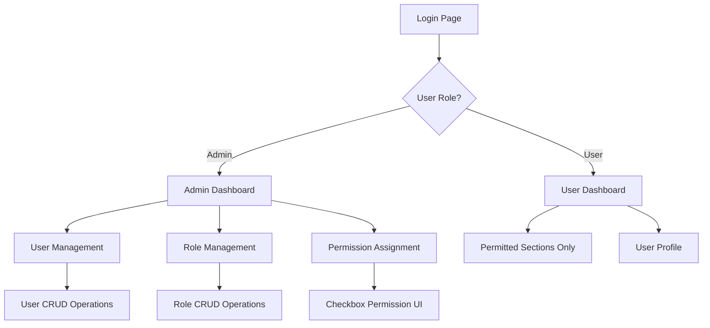

## 1. Product Overview
A comprehensive user management system with role-based access control (RBAC) that enables administrators to manage users, roles, and permissions through intuitive dashboards.
- Solves the problem of secure user access control and permission management in web applications by providing granular role-based permissions and visual management interfaces.
- Target market: Enterprise applications, SaaS platforms, and multi-tenant systems requiring sophisticated user access control.

## 2. Core Features

### 2.1 User Roles
| Role | Registration Method | Core Permissions |
|------|---------------------|------------------|
| Admin | System-created or promoted by existing admin | Full access to user management, role management, permission assignment |
| User | Email registration or admin creation | Limited access based on assigned role permissions |

### 2.2 Feature Module
Our user management system consists of the following main pages:
1. **Authentication Pages**: login form, registration form, password reset functionality.
2. **Admin Dashboard**: user management interface, role management interface, permission assignment controls.
3. **User Dashboard**: personalized dashboard showing only permitted sections and features.
4. **User Management Pages**: user CRUD operations, user profile management, role assignment interface.
5. **Role Management Pages**: role CRUD operations, permission configuration, color customization.

### 2.3 Page Details
| Page Name | Module Name | Feature description |
|-----------|-------------|---------------------|
| Login Page | Authentication Form | Email/password login, session management, redirect to appropriate dashboard |
| Register Page | Registration Form | User account creation, email validation, default role assignment |
| Admin Dashboard | Overview Panel | System statistics, recent activities, quick access to management functions |
| Admin Dashboard | User Management | Create, read, update, delete users; assign roles; view user details with color badges |
| Admin Dashboard | Role Management | Create, read, update, delete roles; configure permissions via checkbox UI; set role colors |
| User Dashboard | Personalized Interface | Display only sections allowed by user's role permissions; show user profile with role badge |
| User Profile | Profile Management | Edit personal information, change password, view assigned role and permissions |
| User List | User Directory | Paginated user list with search, filter by role, bulk operations |
| Role Configuration | Permission Matrix | Checkbox interface for assigning permissions to roles; visual permission overview |

## 3. Core Process
**Admin Flow:**
Admins log in and access the admin dashboard where they can manage users (create, edit, delete, assign roles), manage roles (create, edit, delete, configure permissions), and monitor system activity. Permission assignment is done through an intuitive checkbox interface.

**User Flow:**
Users log in and are redirected to their personalized dashboard showing only the sections and features their role permits. They can access their profile, view their permissions, and interact with allowed system features.

## 4. User Interface Design
### 4.1 Design Style
- Primary colors: Blue (#3B82F6) for admin functions, Green (#10B981) for user actions
- Secondary colors: Gray (#6B7280) for neutral elements, custom colors for role badges
- Button style: Rounded corners with subtle shadows, hover effects
- Font: Inter or system fonts, 14px base size, 16px for headings
- Layout style: Card-based design with sidebar navigation, responsive grid layouts
- Icons: Lucide React icons for consistency, color-coded badges for roles

### 4.2 Page Design Overview
| Page Name | Module Name | UI Elements |
|-----------|-------------|-------------|
| Admin Dashboard | User Management | Data table with search/filter, action buttons, color-coded role badges, modal dialogs for CRUD |
| Admin Dashboard | Role Management | Role cards with color previews, permission matrix, color picker component |
| User Dashboard | Personalized Interface | Clean card layout, role badge display, conditional section rendering |
| Authentication Pages | Login/Register Forms | Centered forms with validation, password visibility toggle, loading states |
| Permission Assignment | Checkbox Matrix | Organized permission groups, visual hierarchy, save/cancel actions |

### 4.3 Responsiveness
Desktop-first design with mobile-adaptive layouts. Touch-optimized interactions for mobile devices, collapsible sidebar navigation, and responsive data tables with horizontal scrolling on smaller screens.
